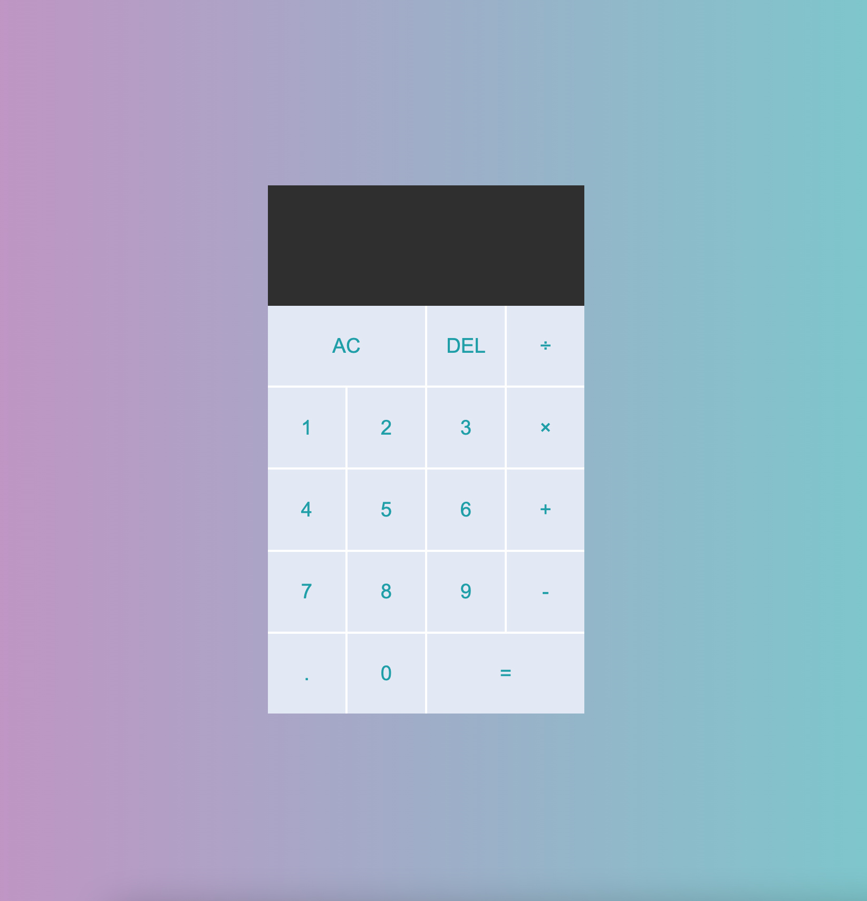

# Javascript Calculator

A functioning javascript calculator including calculations for addition, subtraction, division and multiplication. Functions also exist for deleting incorrectly entered characters and clearing the calculator.

In order to try the calculator out, clone the code and open index.html in your code editor's [live server](https://marketplace.visualstudio.com/items?itemName=ritwickdey.LiveServer). If you do not have one installed in your editor I have provided the link to the live server extension I use for Visual Studio Code.

